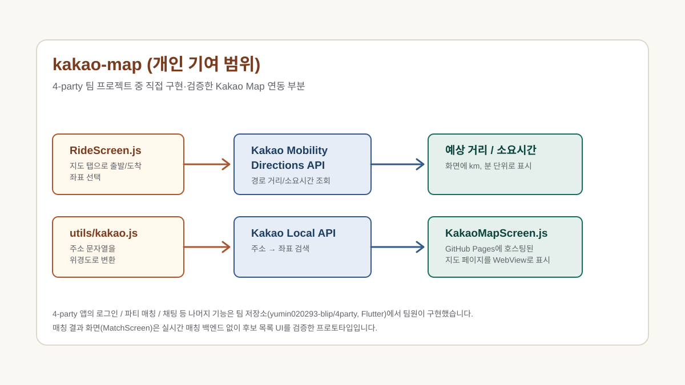

# 4-party (사파리 4-party) — 택시 동승 매칭 앱

명지대학교 학생들의 택시 동승을 지원하는 팀 프로젝트입니다. 전체 서비스는 Flutter +
Node.js/Express + Firebase + Supabase로 4인 팀이 함께 구현했고, 그중 **Kakao Map
연동과 예상 택시 요금(거리/소요시간) 산출 기능**을 직접 설계·구현했습니다.

## Project Type

Team Project (4인)

## Project Period

2025.2학기

## 전체 시스템

- Flutter 모바일 앱 + Node.js/Express 백엔드 + Firebase + Supabase
- 학교 이메일 인증 기반 회원가입/로그인, 실시간 파티 매칭, 오픈채팅 연결, 긴급모집 배너
- 팀 저장소: [github.com/yumin020293-blip/4party](https://github.com/yumin020293-blip/4party)

## 내 기여·검증 범위

- `RideScreen`에서 지도를 탭해 출발지/도착지 좌표를 선택하면 **Kakao Mobility
  Directions API**로 경로 거리(km)와 예상 소요시간(분)을 조회해 화면에 표시
- `utils/kakao.js`에서 **Kakao Local API**로 주소 문자열을 위경도 좌표로 변환하는
  지오코딩 유틸리티 구현
- `KakaoMapScreen`에서 GitHub Pages에 별도 호스팅한 지도 페이지를 WebView로 표시
- 담당 기능은 별도 저장소로 분리 관리: [github.com/nadanaya/kakao-map](https://github.com/nadanaya/kakao-map)
- `MatchScreen`(매칭 결과 화면)은 실시간 매칭 백엔드 없이 후보 목록 UI 흐름만
  검증한 프로토타입입니다 — 후보 데이터는 화면 내 고정값입니다.

## Tech Stack (내 기여 범위 기준)

- React Native (Expo)
- Kakao Mobility Directions API
- Kakao Local API (지오코딩)
- WebView

## Public Recreated Visual

## Security Note

`kakao-map` 저장소에는 한때 Kakao REST API 키가 소스에 하드코딩되어 있었으나,
현재는 `EXPO_PUBLIC_KAKAO_REST_API_KEY` 환경 변수로 분리되어 있고 실제 키 값은
커밋되지 않습니다.
