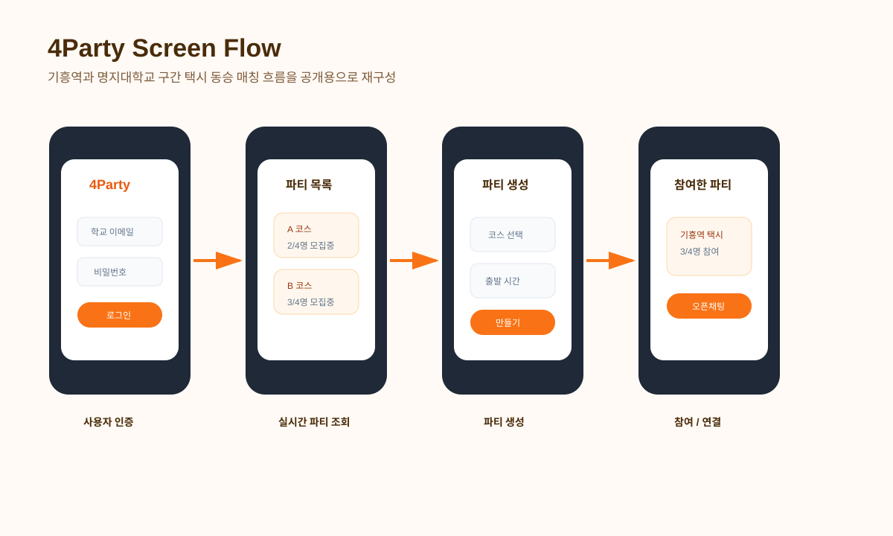
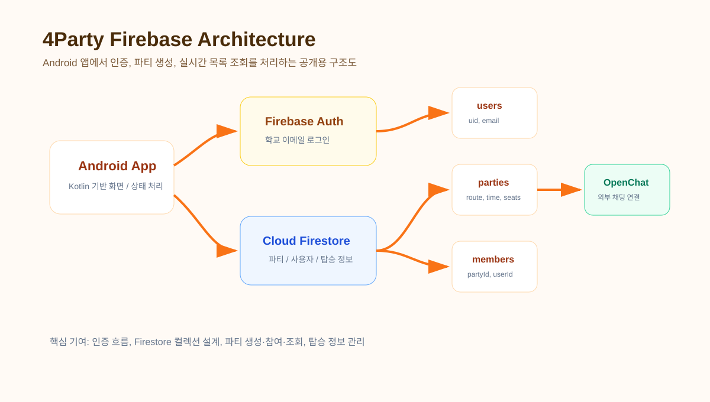
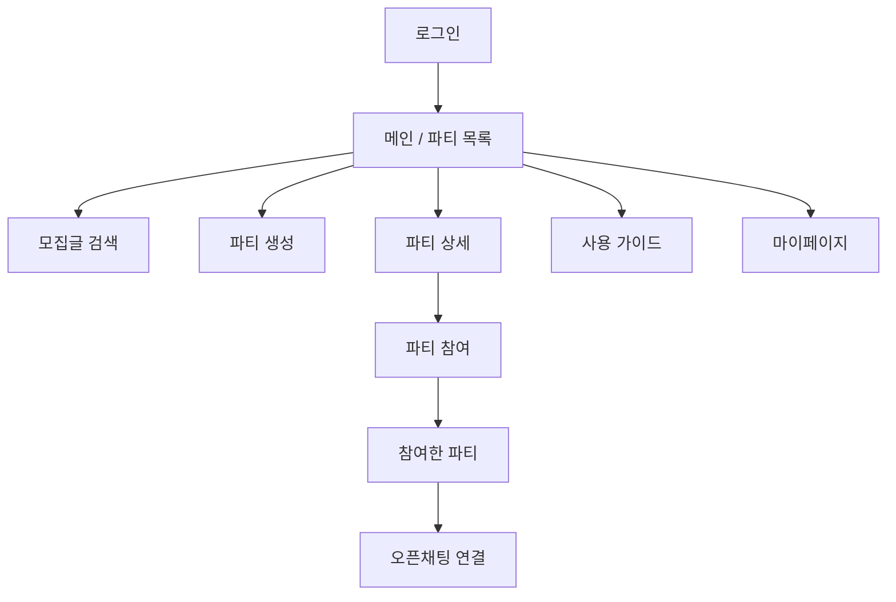
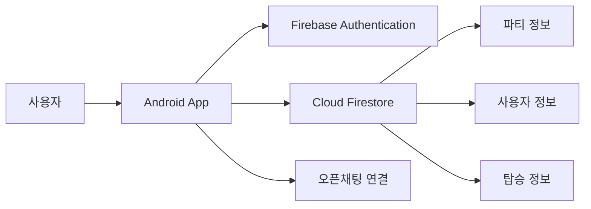
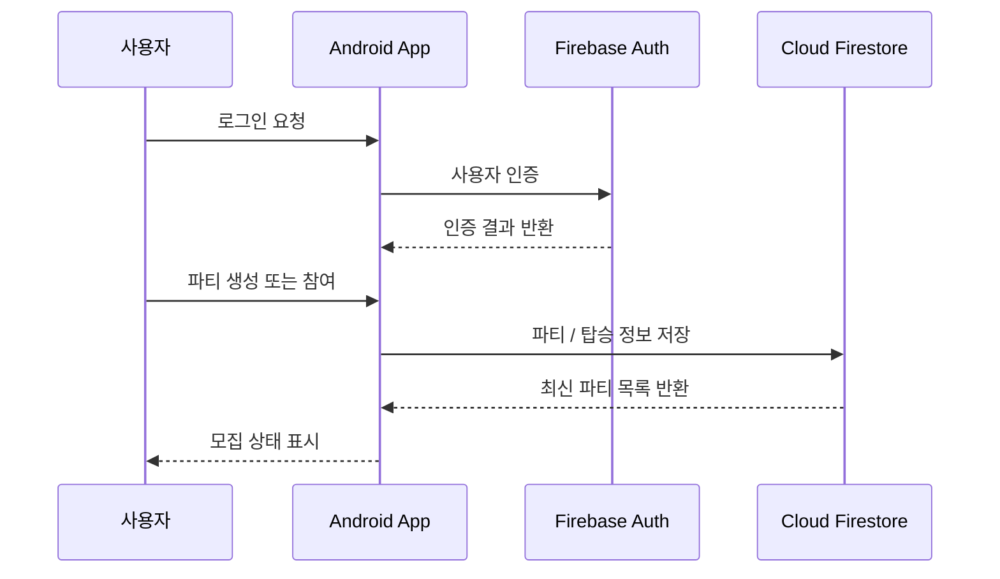

# 4Party - 택시 동승 매칭 서비스

기흥역과 명지대학교를 오가는 학생들의 택시 동승을 지원하는 Android 기반 서비스입니다. 사용자 인증, 파티 생성·참여, 실시간 파티 조회 기능을 구현했습니다.

## Project Type

Team Project

## Project Period

2025.09 ~ 2025.12

## My Contribution

- Firebase Authentication 기반 로그인 구현
- Cloud Firestore 데이터베이스 설계 및 연동
- 파티 생성·조회·참여 기능 개발
- 사용자 정보 및 탑승 정보 관리
- Git/GitHub 기반 협업

## Main Features

- 동승 파티 생성 및 참여
- 실시간 파티 목록 조회
- 사용자 인증
- 오픈채팅 연결
- 탑승 정보 관리

## Tech Stack

- Android
- Kotlin
- Firebase Authentication
- Cloud Firestore
- Git

## Screen Scope

- 로그인: 학교 이메일과 비밀번호 기반 사용자 인증
- 파티 생성: 탑승 장소, 출발 날짜와 시간, 최대 인원 입력
- 파티 목록: 현재 모집 중인 동승 파티 실시간 조회
- 참여한 파티: 내가 참여한 파티와 모집 상태 확인
- 사용 가이드: 동승 참여 절차와 주의사항 안내
- 마이페이지: 사용자 정보와 참여 내역 관리

## Public Recreated Visuals

아래 이미지는 팀 내부 설계서 원본을 그대로 공개하지 않고, 포트폴리오 공개용으로 화면 흐름과 Firebase 구조만 새로 재구성한 자료입니다.

### Screen Flow

### Firebase Architecture

## Screen Flow

## Architecture

## Data Flow

