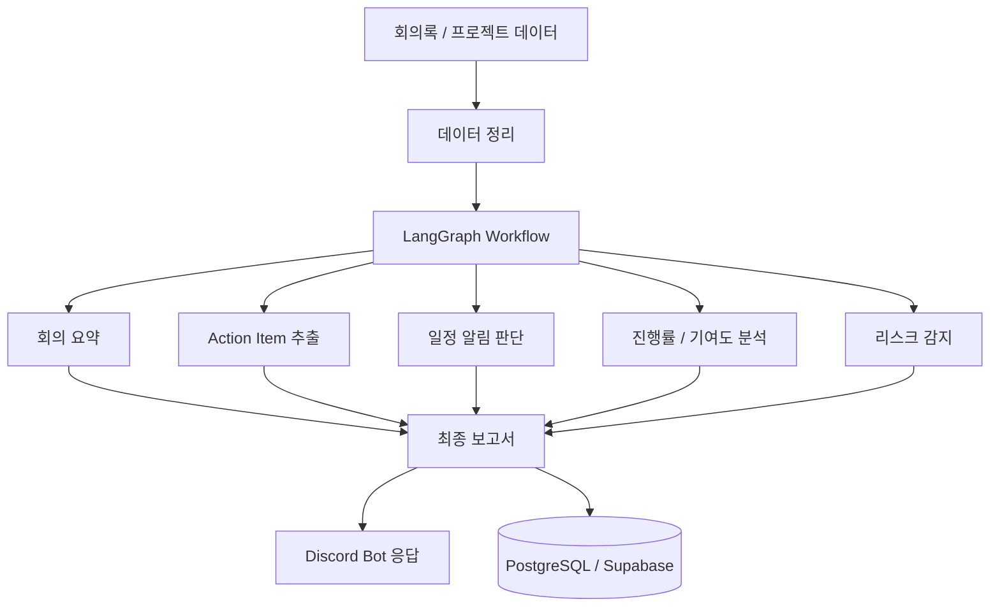
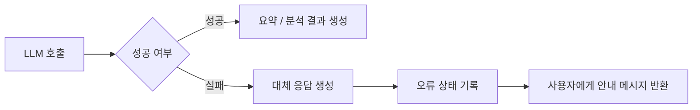

# AI Agent System

포트폴리오 공개용 요약 자료입니다. 실제 `.env`, 토큰, DB 파일, PDF 산출물은 포함하지 않았습니다.

## Source Repository

실제 공개 가능한 AI Agent 코드는 별도 저장소에서 확인할 수 있습니다.

https://github.com/nadanaya/ai-agent

포트폴리오 저장소에는 프로젝트 소개와 기여 내용을 정리하고, 실제 코드 저장소는 위 링크로 분리했습니다.

## Project Type

Team Project

## My Contribution

- Python 기반 AI Agent 백엔드 로직 구현
- Supabase(PostgreSQL) 데이터 저장 구조 및 SQL 스키마 구성
- Discord Bot 명령과 Agent 실행 흐름 연동
- 프로젝트 종료 리포트 생성 기능 구현 및 테스트
- LLM 응답 결과를 Markdown 보고서로 정리하는 흐름 구현

## Main Features

- 회의 내용 요약 및 Action Item 추출
- D-7·D-3·D-1 일정 알림
- 업무 진행률과 팀원 기여도 분석
- 리스크 감지 및 프로젝트 종료 리포트 생성
- LLM 호출 실패 시 대체 응답 처리
- Discord Bot 기반 명령 흐름

## Tech Stack

- Python
- LangGraph
- LLM
- PostgreSQL / Supabase
- Discord Bot
- Markdown report generation

## Public Code Structure

`nadanaya/ai-agent` 저장소의 주요 구조입니다.

```text
ai_agent/
  _core/       scoring and analysis logic
  _graph/      workflow and graph nodes
  _services/   database, LLM, PDF, project-data services
  _discord/    Discord bot entry points
  _cli/        local preview command
data/          sample project payloads
sql/           Supabase schema and seed scripts
tests/         pytest tests
```

## Agent Flow



## Failure Handling



## Security Note

민감 정보 보호를 위해 아래 항목은 공개 저장소에 업로드하지 않았습니다.

- `.env`
- API key / token
- DB 파일
- audit archive PDF
- 가상환경 폴더
