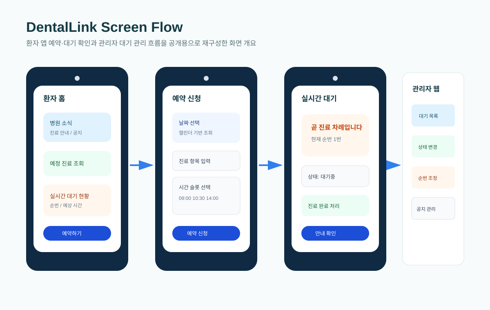
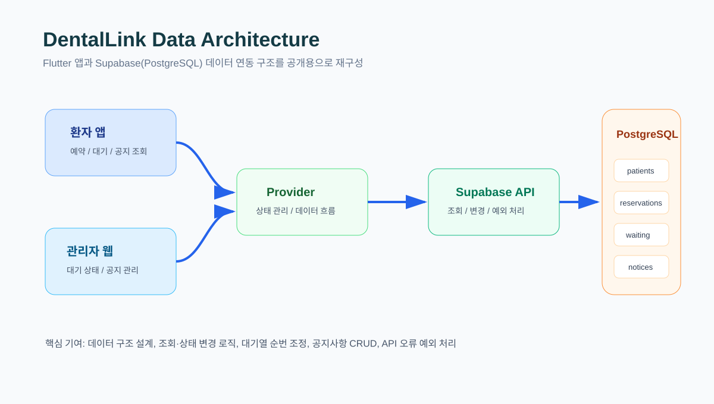
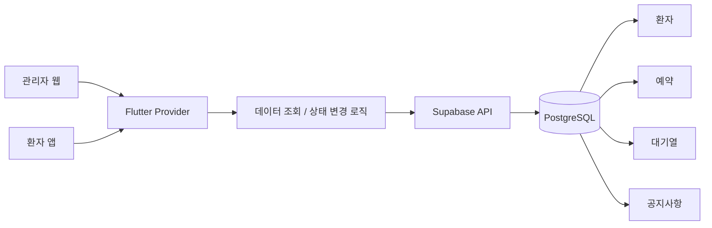
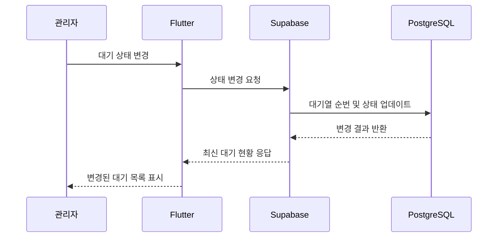

# DentalLink

치과 관리자 웹과 환자 앱을 함께 제공하는 팀 프로젝트입니다. Supabase(PostgreSQL)를 기반으로 환자, 예약, 대기열, 공지사항 데이터를 관리하고 Flutter 앱과 연동했습니다.

## Analysis View

- Problem: 예약, 대기열, 공지 데이터가 여러 화면에 나뉘어 있어 병원 운영 상태를 한 번에 파악하기 어려웠습니다.
- Data: 환자, 예약, 대기열, 공지사항, 상태 변경 이력을 중심으로 서비스 데이터를 설계했습니다.
- Metrics: 예약 현황, 대기 순번, 대기 상태, 공지 노출 여부, 환자별 조회 가능 정보를 확인할 수 있게 했습니다.
- Action: 관리자 웹과 환자 앱이 같은 기준의 최신 데이터를 조회하도록 상태 변경 후 재조회 흐름과 예외 처리를 정리했습니다.

## Project Type

Team Project

## Project Period

2026.03 ~ 2026.06

## My Contribution

- Supabase(PostgreSQL) 기반 데이터 구조 설계 및 연동
- 환자·예약·대기열·공지사항 데이터 처리 기능 구현
- 관리자 웹 대기 관리 및 공지 관리 기능 개발 지원
- Flutter와 Supabase 간 데이터 조회·상태 변경 로직 구현
- Git/GitHub 기반 기능 브랜치 관리 및 협업

## Main Features

- 예약 및 대기 현황 조회
- 대기 상태 변경과 순번 자동 조정
- 환자 PIN 인증 및 데이터 조회
- 공지사항 등록·수정·조회
- 데이터 누락 및 API 오류 예외 처리

## Tech Stack

- Flutter
- Dart
- Supabase
- PostgreSQL
- Provider
- REST API

## Screen Scope

- 환자 앱 홈: 병원 소식, 예정 진료, 실시간 대기 현황, 안내 정보 확인
- 예약 캘린더: 예약 가능 날짜 조회 및 날짜 선택
- 예약 신청: 병원, 예약 날짜, 진료 항목, 예약 시간 선택
- 실시간 대기: 현재 대기 순번과 상태 확인
- 진료 완료: 대기열 종료와 다음 예약 안내 표시

## Public Recreated Visuals

아래 이미지는 팀 내부 보고서 원본을 그대로 공개하지 않고, 포트폴리오 공개용으로 화면 흐름과 데이터 구조만 새로 재구성한 자료입니다.

### Screen Flow

### Data Architecture

## Architecture

## Data Flow

## Troubleshooting

### 대기 상태 변경 후 순번이 어긋나는 문제

대기열 상태를 변경할 때 완료 처리된 환자와 대기 중인 환자의 순번이 함께 갱신되어야 했습니다. 상태 변경 로직에서 최신 대기 목록을 다시 조회하고, 대기 상태별 표시 순서를 재계산하도록 처리해 관리자 화면과 환자 앱의 대기 현황이 같은 기준으로 보이게 정리했습니다.

### 데이터 누락 및 API 오류 처리

환자 PIN 인증, 예약 조회, 공지사항 조회 과정에서 데이터가 없거나 응답이 비어 있는 경우 화면이 멈추지 않도록 기본 상태와 예외 메시지를 분리했습니다. 이를 통해 Supabase 응답 실패나 누락 데이터가 있어도 사용자가 현재 상태를 이해할 수 있게 했습니다.

## Repository Note

팀 프로젝트 저장소는 팀 단위로 관리되어 전체 소스를 직접 공개하지 않고, 포트폴리오에는 본인이 담당한 역할과 구현 기능을 중심으로 정리했습니다.

