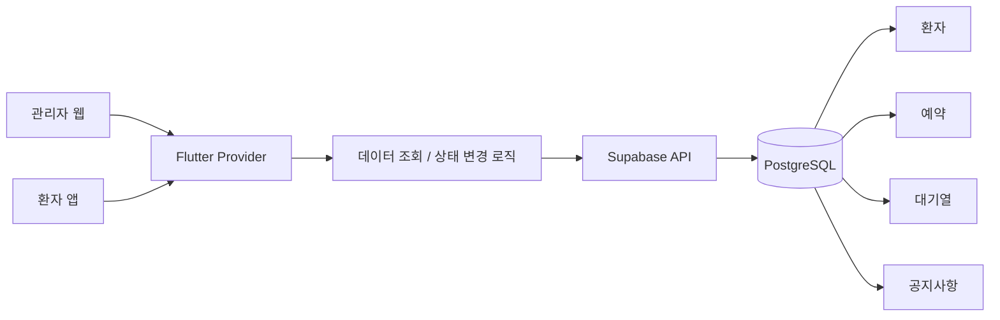
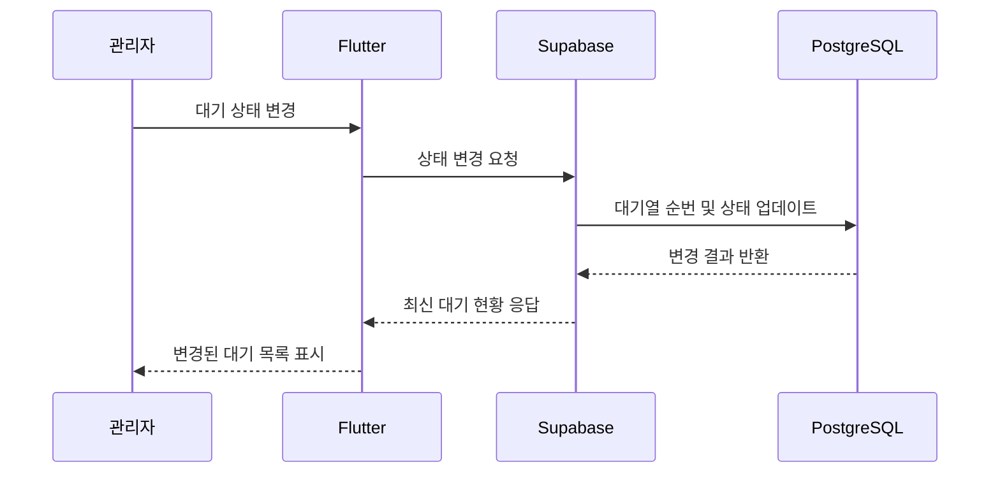

# DentalLink

치과 관리자 웹과 환자 앱을 함께 제공하는 팀 프로젝트입니다. Supabase(PostgreSQL)를 기반으로 환자, 예약, 대기열, 공지사항 데이터를 관리하고 Flutter 앱과 연동했습니다.

## Project Type

Team Project

## Project Period

2026.03 ~ 2026.06

## My Contribution

- Supabase(PostgreSQL) 기반 데이터 구조 설계 및 연동
- 환자·예약·대기열·공지사항 데이터 처리 기능 구현
- 관리자 웹 대기 관리 및 공지 관리 기능 개발 지원
- Flutter와 Supabase 간 데이터 조회·상태 변경 로직 구현
- Git/GitHub 기반 기능 브랜치 관리 및 협업

## Main Features

- 예약 및 대기 현황 조회
- 대기 상태 변경과 순번 자동 조정
- 환자 PIN 인증 및 데이터 조회
- 공지사항 등록·수정·조회
- 데이터 누락 및 API 오류 예외 처리

## Tech Stack

- Flutter
- Dart
- Supabase
- PostgreSQL
- Provider
- REST API

## Screen Scope

- 환자 앱 홈: 병원 소식, 예정 진료, 실시간 대기 현황, 안내 정보 확인
- 예약 캘린더: 예약 가능 날짜 조회 및 날짜 선택
- 예약 신청: 병원, 예약 날짜, 진료 항목, 예약 시간 선택
- 실시간 대기: 현재 대기 순번과 상태 확인
- 진료 완료: 대기열 종료와 다음 예약 안내 표시

## Architecture

## Data Flow

## Repository Note

팀 프로젝트 저장소는 팀 단위로 관리되어 전체 소스를 직접 공개하지 않고, 포트폴리오에는 본인이 담당한 역할과 구현 기능을 중심으로 정리했습니다.

