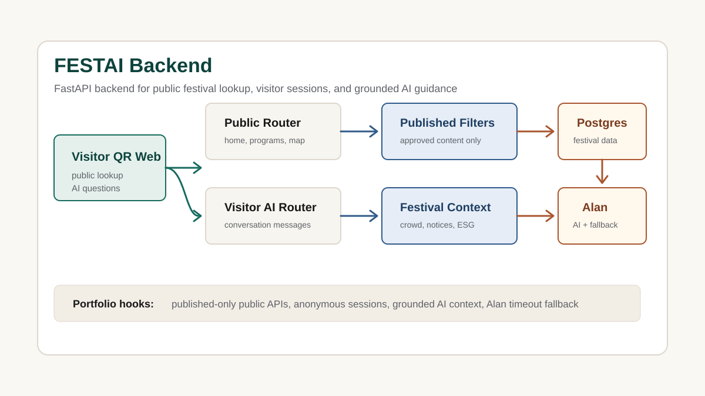

# FESTAI Backend

AI·ESG 기반 지역축제 운영 플랫폼을 위한 FastAPI 백엔드입니다. 방문객 QR 모바일 웹, 운영자 콘솔, 참여업체 콘솔이 함께 쓰는 공개 조회 API와, 승인된 운영 데이터만 근거로 삼는 AI 안내 흐름을 중심으로 정리했습니다.

## Source Repository

https://github.com/FEST-ON/Backend

## Project Type

Team Project

## Contribution Scope

FESTAI는 팀 프로젝트이므로 아래 문서는 전체 백엔드 기능 범위와 개인 기여 범위를 분리해 설명합니다.

- 전체 시스템: 방문객 QR 웹, 운영자 콘솔, 참여업체 콘솔이 사용하는 FastAPI/PostgreSQL 백엔드
- 직접 정리·구현·검증한 범위: 공개 조회 API의 게시 상태 필터링, 승인된 festival context 기반 AI 안내 흐름, Alan 호출 실패 시 fallback 흐름, 방문 세션 토큰 해시 처리, AI context/API/SQL 테스트 근거 정리
- 이력서 표기 원칙: 팀 저장소의 전체 기능을 개인 단독 구현으로 쓰지 않고, 담당 API와 검증한 파일 링크를 함께 제시합니다.

## Tech Stack

- Python 3.12+
- FastAPI
- PostgreSQL
- Docker / Railway
- Alan (외부 AI, 규칙 기반 폴백)
- CosyVoice 3 (선택적 음성합성)

## Implemented API Scope

| 영역 | 경로 | 기능 |
| --- | --- | --- |
| 인증 | `/auth/*`, `/me` | 로그인, 토큰, 계정 관리 |
| 기준정보 | `/admin/festivals/*` | 축제·구역·시설 CRUD |
| 콘텐츠 | `/admin/.../content-items` | 버전 작성·검수·승인·게시 |
| 공개 조회 | `/public/festivals/{code}/*` | 축제 정보, 프로그램, 지도 |
| 방문객 | `/visitor/*` | 세션, 설문, 민원, AI 대화 |
| 예약 | `/visitor/bookings` | 예약·대기표·정원 제어 |
| 운영 | `/crowd-snapshots`, `/dashboard` | 혼잡, 인력 배치, 예측 |
| ESG | `/esg/*`, `/reward-campaigns` | 지표 관리·보고서·포인트 |
| 상권 | `/admin/.../businesses`, `/merchant/*` | 업체·쿠폰·추천 |

## Data Model

- **축제(Festivals)**: 구역·시설·프로그램을 포함하는 기본 단위
- **프로그램·회차(Programs/Sessions)**: 예약·대기표 정원 관리
- **방문 세션**: 익명 QR 인증(24시간 유효), 원문 토큰 대신 해시로 저장
- **티켓**: `OPEN → ASSIGNED → IN_PROGRESS → RESOLVED → CLOSED` 상태 흐름
- **ESG 실적**: 승인 후 정정 불가, 새 실적으로만 수정
- **리워드 캠페인**: 캠페인별 일일 포인트 한도 분리
- **감사 로그**: DB 트리거로 삭제·수정 차단

## Analysis View

- Problem: 공개 조회 API가 미승인·미게시 콘텐츠를 그대로 노출하거나, AI 응답이 검증되지 않은 운영 데이터를 근거로 답하면 신뢰도가 떨어집니다.
- Data: 게시된 축제, 승인된 콘텐츠 버전, 혼잡·공지·프로그램·ESG 데이터를 공개 조회용과 AI 컨텍스트용으로 구분해 집계합니다.
- Metrics: 공개 API 응답의 게시 상태 필터링 여부, AI 컨텍스트에 포함되는 승인 데이터 비중, Alan 폴백 발생 빈도로 안전성을 확인할 수 있습니다.
- Action: FastAPI 라우터를 auth·public·visitor·admin·merchant 영역으로 분리하고, Alan GET 호출은 질문별 컨텍스트 선택과 URL 길이 상한 처리로 안정화했습니다.
- Result: 검증된 festival context만 AI에 전달하는 안전한 방문객 안내 흐름과, 호출 실패 시 기존 fallback 응답을 유지하는 구조를 구현했습니다.

## Backend Deep-Dive

### 1. 공개 API의 게시 상태 필터링

`/public/festivals/{code}/*` 라우트는 게시된 축제와 승인·게시된 콘텐츠 버전만 반환합니다. 감사 로그는 DB 트리거로 삭제·수정을 차단해, 승인 이력을 임의로 되돌릴 수 없도록 합니다.

### 2. Alan AI 연동과 URL 길이 문제

Alan GET 호출은 컨텍스트가 길어지면 URL 길이 제한에 걸리는 문제가 있었습니다. 질문별로 필요한 festival context만 선택하고 길이 상한을 적용해 이 문제를 줄였고, 호출 실패 시에는 기존 규칙 기반 fallback 응답을 유지하도록 설계했습니다.

### 3. 익명 방문 세션의 보안 처리

방문 세션은 QR 인증 후 24시간 유효하며, 원문 토큰 대신 해시를 저장해 세션 정보 유출 위험을 줄였습니다. 응답에는 Alan AI 사용 여부를 드러내, 방문객이 AI 응답과 운영자 응답을 구분할 수 있게 했습니다.

## Testing

AI festival context, 전처리, API, SQL, 잡(job) 테스트로 승인 데이터 기반 응답과 예외 경로를 검증합니다.

## Public API Flow

`public-ai-context-flow.svg`는 FEST-ON/Backend `origin/main`의 README와 소스 구조를 기반으로, 방문객 QR 웹부터 공개 조회 API, 축제 운영 컨텍스트, Alan AI 폴백까지 이어지는 흐름을 재구성한 이미지입니다.

