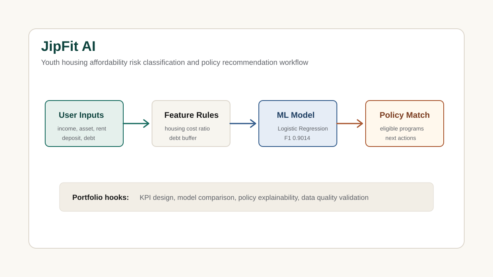

# JipFit AI

청년의 소득, 자산, 주거비, 보증금, 부채 조건을 바탕으로 주거비 부담 위험을 분류하고, 조건에 맞는 청년 주거 정책을 추천하는 데이터 분석 및 ML 프로젝트입니다.

## Source Repository

https://github.com/nadanaya/jipfit-ai

## Project Type

Data Analysis / ML / Streamlit App

## Tech Stack

- Python
- Streamlit
- Pandas
- scikit-learn
- SQLite
- SQL
- pytest

## Analysis View

- Problem: 청년은 월세, 관리비, 보증금, 부채, 소득을 함께 고려해 실제 주거비 부담과 정책 적합성을 판단하기 어렵습니다.
- Data: 소득, 자산, 보증금, 월세, 관리비, 부채, 고용 상태, 지역 비용지수, 정책 조건 데이터를 사용합니다.
- Metrics: 총 주거비, 권장 주거비 상한, 소득 대비 주거비 비율, 부채 반영 버퍼, 주거비 부담 위험 등급을 설계했습니다.
- Model: 합성 주거 시나리오 6,000건을 생성하고 Logistic Regression, Random Forest 등을 비교했습니다.
- Result: Logistic Regression 기준 Accuracy 0.9308, Macro F1 0.9014로 안정/주의/위험 부담 등급을 분류했습니다.

## Business Insight

은행/핀테크 관점에서는 단순 대출 한도 계산이 아니라, 사용자의 현금흐름과 주거비 부담을 함께 고려한 사전 진단 기능으로 확장할 수 있습니다.

- 청년 사용자의 주거비 부담 위험을 조기에 탐지
- 소득 대비 주거비 비율을 기반으로 예산 가이드 제공
- 정책 조건 매칭을 통해 사용자가 확인해야 할 지원 제도 추천
- 금융 상담, 대출 심사 보조, 개인화 자산관리 서비스의 입력 지표로 활용 가능

## Portfolio Message

이 프로젝트는 데이터 분석가 포트폴리오에서 **문제 정의, 지표 설계, 모델 성능 비교, 정책 추천 로직, 검증 리포트**를 한 번에 보여줄 수 있는 대표 프로젝트입니다.

## Public Workflow

