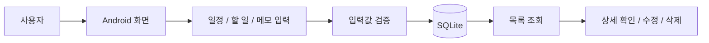

# Life Manager Android App

생활관리 기능을 Android 앱으로 구현한 프로젝트입니다. 일정, 할 일, 메모 데이터를 앱 안에서 관리하며 사용자가 일상 기록을 저장하고 다시 확인할 수 있도록 구성했습니다.

## Project Type

Team Project

## My Contribution

- Android 앱 주요 화면 구성 및 기능 구현 참여
- 일정, To-do, 메모 데이터의 등록·수정·삭제 흐름 구현
- UI와 로컬 데이터 저장 로직 연동
- 사용자 입력값 검증과 예외 상황 처리

## Main Features

- 일정 등록, 수정, 삭제
- 할 일(To-do) 목록 관리와 완료 상태 처리
- 메모 작성 및 생활 기록 관리
- 날짜 기반 데이터 조회

## Tech Stack

- Android
- Kotlin
- SQLite
- XML
- UI/UX

## App Flow

## Data Scope

- 일정: 날짜, 제목, 내용, 상태
- 할 일: 제목, 완료 여부, 등록일
- 메모: 제목, 본문, 수정일

