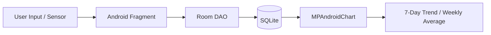
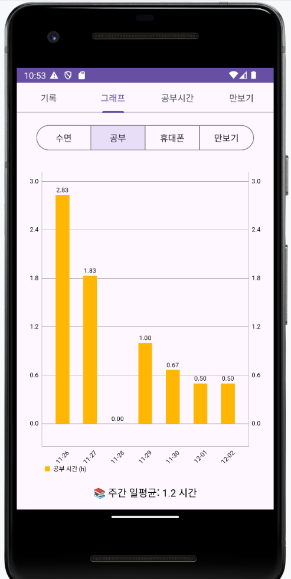
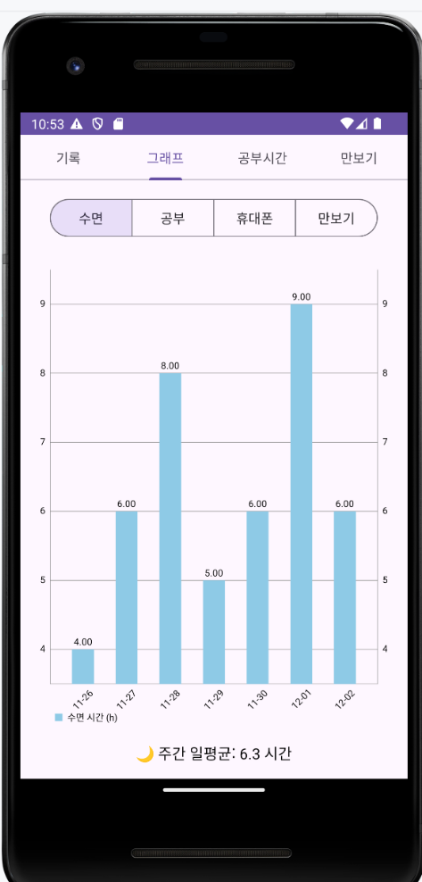
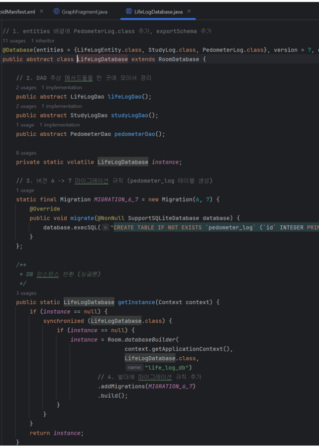
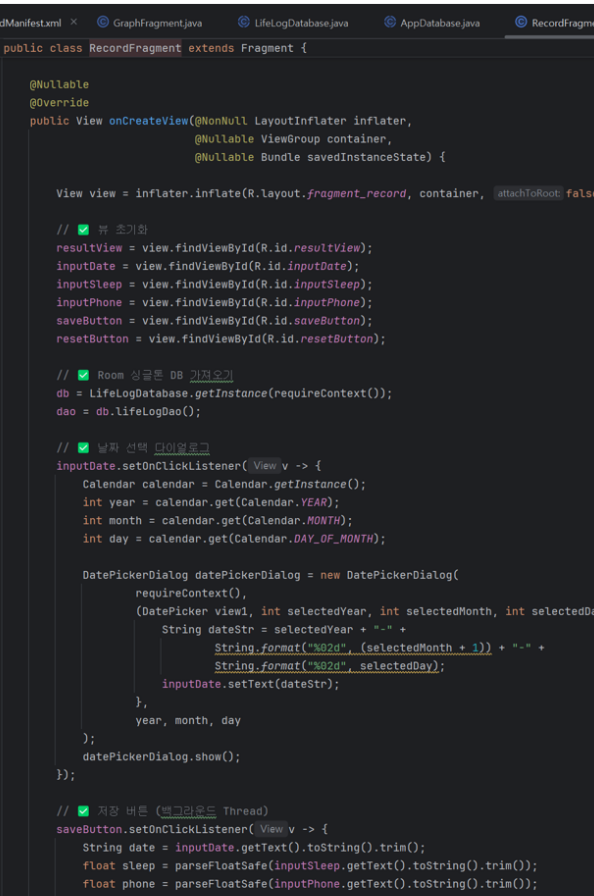

# Life Manager Android App

수면, 공부, 휴대폰 사용 시간, 걸음 수를 기록하고 최근 7일 흐름을 그래프로 확인하는 네이티브 Android 생활 관리 앱입니다.  
생활 기록을 Room/SQLite에 저장하고 MPAndroidChart로 시각화하며, 최근 수정에서는 UI 디자인 개선과 그래프 반영 안정화를 함께 진행했습니다.

## Project Summary

- Repository: https://github.com/nadanaya/life-manager
- Type: Team Project
- Period: 2025.09 ~ 2025.12
- Role: Android 화면 구현, Room 데이터 저장 흐름, 그래프 반영 로직 개선

## Main Features

- 날짜별 수면 시간과 휴대폰 사용 시간 기록
- 과목별 공부 타이머 및 수동 시간 조정
- 최근 7일 수면/공부/휴대폰/걸음 수 막대 그래프
- Android 걸음 센서 기반 만보기와 목표 달성률 표시
- 하루 걸음 목표 설정 및 저장

## Recent Improvements

- 전체 화면을 카드형 레이아웃과 일관된 색상 시스템으로 리디자인
- 깨져 있던 한글 탭, 버튼, 안내 문구, 토스트 메시지 복구
- 공부 시간이 1분 미만이어도 그래프에 반영되도록 `elapsedMillis` 기반 집계 추가
- 날짜별 모든 과목 공부 시간을 합산해 공부 그래프에 반영
- 만보기 화면의 `todaySteps` 값을 DB에 동기화해 그래프 반영 안정화
- 그래프 Y축 최소값을 0으로 고정해 `-0.4` 같은 음수 눈금 제거
- 그래프 날짜 라벨을 `MM.dd` 형식으로 정리

## Data Flow



## Study Graph Logic

공부 시간은 과목별로 저장되지만 그래프에서는 날짜 단위로 합산됩니다.

```sql
SELECT IFNULL(
  SUM(CASE
    WHEN elapsedMillis > 0 THEN elapsedMillis
    ELSE duration * 60000
  END),
  0
)
FROM study_log
WHERE date = :dateStr
```

- `StudyFragment`에서 과목별 `elapsedMillis`를 저장합니다.
- `StudyLogDao.getTotalStudyMillisByDate()`가 해당 날짜의 모든 과목 시간을 합산합니다.
- `GraphFragment`가 밀리초 값을 시간 단위로 변환해 공부 그래프에 표시합니다.

## Pedometer Graph Logic

- `StepCounterFragment`는 센서 이벤트 발생 시 오늘 걸음 수를 `life_log.stepCount`에 저장합니다.
- 탭 재진입 시에도 현재 `todaySteps`를 DB에 다시 저장해 화면 값과 그래프 값이 어긋나지 않도록 보강했습니다.
- `GraphFragment`는 `LifeLogDao.getStepsByDate()`로 최근 7일 걸음 수를 읽어 그래프에 표시합니다.

## Tech Stack

- Android Java
- Room
- SQLite
- MPAndroidChart
- Material Components
- ViewPager2
- XML Layout

## Screens & Evidence

### Study Time Graph



과목별로 저장된 공부 시간을 날짜별 합산값으로 보여주는 최근 7일 공부 시간 그래프입니다.

### Sleep Time Graph



수면 기록을 날짜별 막대 그래프로 시각화하고 주간 평균을 함께 확인하는 화면입니다.

### Room Database Code



`LifeLogEntity`, `StudyLog`, `PedometerLog`를 Room Entity로 관리하고, 생활 기록/공부 기록/걸음 수 기록을 SQLite에 저장하는 구조입니다.

### Record Fragment Code



날짜 선택, 수면 시간 입력, 휴대폰 사용 시간 저장 흐름을 담당하는 기록 화면 코드입니다.

## Data Scope

- 수면 기록: 날짜, 수면 시간
- 공부 기록: 날짜, 과목, 공부 시간, 밀리초 단위 누적 시간
- 휴대폰 기록: 날짜, 사용 시간
- 만보기 기록: 날짜, 걸음 수

## Verification

- `./gradlew assembleDebug` 성공
- `./gradlew installDebug` 성공
- Android Emulator 실행 확인
- GitHub `life-manager` 저장소 `main` 브랜치 push 완료
