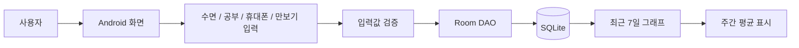

# Life Manager Android App

생활관리 기능을 Android 앱으로 구현한 프로젝트입니다. 수면, 공부, 휴대폰 사용, 만보기 데이터를 기록하고 최근 7일 기준 그래프로 확인할 수 있도록 구성했습니다.

## Project Type

Team Project

## Project Period

2025.09 ~ 2025.12

## My Contribution

- Android 앱 주요 화면 구성 및 기능 구현 참여
- 생활 기록 데이터의 입력·저장·조회 흐름 구현
- UI와 Room 기반 로컬 데이터 저장 로직 연동
- 사용자 입력값 검증과 예외 상황 처리
- 최근 7일 데이터를 기반으로 그래프와 주간 평균 표시

## Main Features

- 수면, 공부, 휴대폰 사용 시간 입력 및 저장
- 최근 7일 기준 생활 기록 그래프 시각화
- 주간 평균 계산 및 분석 문구 표시
- Room Migration을 통한 만보기 데이터 테이블 확장
- 날짜 기반 데이터 조회

## Tech Stack

- Android
- Java
- Room
- SQLite
- XML
- UI/UX

## Screens & Evidence

### Study Time Graph

최근 7일 공부 시간을 막대 그래프로 보여주고, 주간 평균 공부 시간을 계산해 표시하는 화면입니다.

### Sleep Time Graph

수면 기록을 날짜별로 시각화하고 평균 수면 시간을 함께 보여주는 화면입니다.

### Room Database Code

`LifeLogDatabase`에서 `LifeLogEntity`, `StudyLog`, `PedometerLog`를 Room Entity로 관리하고, 버전 마이그레이션을 통해 만보기 테이블을 확장한 코드입니다.

### Record Fragment Code

생활 기록 입력 화면에서 날짜 선택, 수면 시간, 휴대폰 사용 시간 입력값을 받아 Room DB에 저장하는 흐름입니다.

## App Flow

## Data Scope

- 수면 기록: 날짜, 수면 시간
- 공부 기록: 날짜, 공부 시간
- 휴대폰 기록: 날짜, 사용 시간
- 만보기 기록: 날짜, 걸음 수

