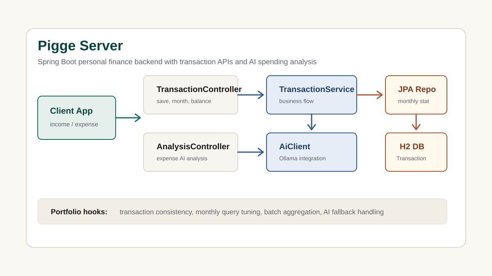

# Pigge Server

가계부 앱을 위한 Spring Boot 백엔드입니다. 수입/지출 거래를 저장하고, 사용자별 거래 내역과 월별 거래 내역, 총 잔액을 조회하며, 월별 통계와 소비 내역을 기반으로 AI 요약/분석을 제공합니다.

## Source Repository

https://github.com/nadanaya/pigge_server

## Project Type

Personal Backend Project

## Tech Stack

- Java 17
- Spring Boot
- Spring Web MVC
- Spring Data JPA
- H2
- Gradle
- RestTemplate
- Ollama

## Implemented API Scope

| Method | Path | Purpose |
| --- | --- | --- |
| `POST` | `/api/transactions` | 수입/지출 거래 저장 |
| `GET` | `/api/transactions/{userEmail}` | 사용자별 전체 거래 조회 |
| `GET` | `/api/transactions/month` | 사용자별 월별 거래 조회 |
| `GET` | `/api/transactions/balance/{userEmail}` | 총 잔액 조회 |
| `POST` | `/api/transactions/with-ai` | 거래 저장 후 월별 통계 기반 AI 요약 생성 |
| `POST` | `/api/analysis/expense` | 소비 내역 텍스트 기반 AI 분석 |
| `GET` | `/api/ai/test` | AI 연결 테스트 |

## Data Model

`Transaction` Entity는 다음 필드를 기준으로 거래 원장을 구성합니다.

- `id`: 거래 식별자
- `title`: 거래명
- `amount`: 금액
- `date`: 거래일
- `type`: `INCOME` 또는 `EXPENSE`
- `userEmail`: 사용자 식별 이메일

## Analysis View

- Problem: 사용자는 거래를 기록하지만 월별 소비 흐름, 잔액 변화, 지출 개선 포인트를 즉시 파악하기 어렵습니다.
- Data: 수입/지출 거래 원장, 사용자 이메일, 거래일, 금액, 거래 유형을 기준으로 월별 데이터를 구성합니다.
- Metrics: 월별 수입, 월별 지출, 월별 잔액, 지출 비중, 예산 초과 가능성, 반복 지출 패턴을 지표화할 수 있습니다.
- Action: 월별 통계와 AI 요약을 연결해 사용자가 다음 달 소비를 조정할 수 있는 코멘트를 제공합니다.
- Result: 단순 가계부 CRUD를 개인 금융관리 서비스의 분석/추천 기능으로 확장할 수 있습니다.

## Backend Deep-Dive

### 1. 거래 저장과 AI 요약 흐름의 정합성

`POST /api/transactions/with-ai`는 거래 저장 후 월별 통계를 조회하고 AI 코멘트를 생성하는 흐름입니다. 포트폴리오에서는 저장 트랜잭션과 AI 호출 실패 처리를 분리해, 거래 데이터는 안정적으로 저장하고 AI 분석 실패는 fallback 응답으로 처리하는 개선 과제로 보여줄 수 있습니다.

### 2. 월별 조회 성능 최적화

현재 월별 조회와 월별 통계는 연도/월 조건으로 거래를 필터링합니다. 데이터가 많아질 경우 `userEmail`, `date`, `type` 기준 복합 인덱스와 날짜 범위 조건을 적용해 월별 조회 성능을 개선하는 주제로 확장할 수 있습니다.

### 3. 배치 집계와 알림 기능

월별 통계, 잔액, 예산 초과 여부를 매 요청마다 계산하지 않고 일/월 단위 집계 테이블로 관리하면 홈 화면과 리포트 API의 부하를 줄일 수 있습니다. 이후 예산 초과 알림, 월간 소비 리포트, AI 소비 코칭 기능으로 확장할 수 있습니다.

## Testing Evidence

`TransactionServiceTest`로 거래 저장, 사용자별 잔액 계산, 월별 거래 조회, AI 요약 응답 생성을 검증합니다. AI 호출은 테스트에서 mock 처리해 외부 Ollama 서버 없이 서비스 로직만 확인할 수 있게 했습니다.

## Public API Flow

