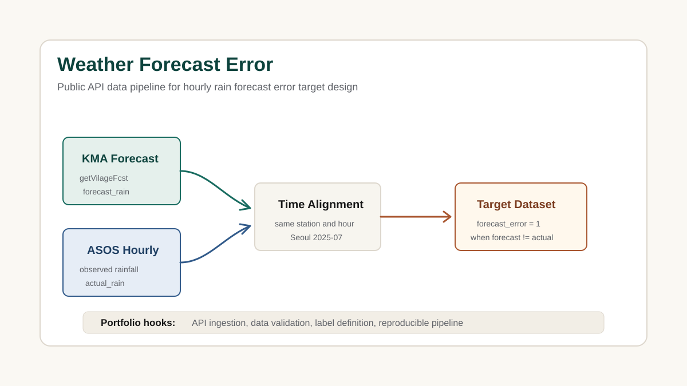

# Weather Forecast Error

기상청 단기예보 API와 서울 ASOS 관측 데이터를 결합해 시간대별 강수 예보 오차 여부를 정의한 공공 데이터 파이프라인 프로젝트입니다.

## Source Repository

https://github.com/nadanaya/weather-forecast-error

## Project Type

Data Pipeline / Public API / Classification Dataset

## Tech Stack

- Python
- Pandas
- Public API
- Data Validation
- Classification Target Design

## Analysis View

- Problem: 일 단위 강수량만으로는 예보가 어느 시간대에 맞았는지, 또는 틀렸는지 판단하기 어렵습니다.
- Data: 기상청 단기예보 `getVilageFcst`, 서울 ASOS 시간 관측 자료, ASOS 일자료 검증 데이터를 사용했습니다.
- Target: `forecast_rain != actual_rain`이면 `forecast_error = 1`, 같으면 `0`으로 정의했습니다.
- Processing: 예보 강수 여부와 실제 1시간 강수 여부를 같은 시간 단위로 맞추고, 모델링 가능한 최종 데이터셋을 생성했습니다.
- Result: 공공 API 원천 데이터에서 분석 가능한 분류 타깃을 설계하는 과정을 보여줍니다.

## Business Insight

금융권과 직접적인 도메인은 다르지만, 데이터 분석 직무에서 중요한 **외부 API 수집, 원천 데이터 검증, 타깃 정의, 데이터셋 구축** 역량을 보여줄 수 있습니다.

- 예보와 관측 데이터의 기준 시점 불일치 문제 해결
- 일 단위 요약값 대신 시간 관측값을 사용해 라벨 정확도 개선
- 모델링 전 단계의 데이터 품질 점검과 타깃 설계 역량 어필
- 금융 데이터에서도 동일하게 필요한 외부 데이터 결합 및 검증 사고를 증명

## Portfolio Message

이 프로젝트는 데이터 분석가 포트폴리오에서 **데이터 수집과 전처리, 기준 정의, 검증 가능한 타깃 생성** 역량을 보조 카드로 보여주기에 적합합니다.

## Public Workflow

